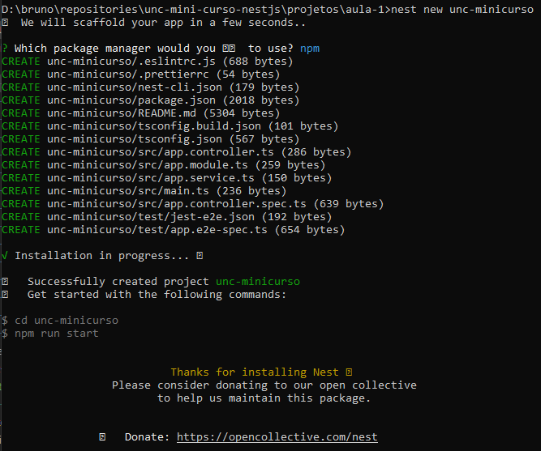
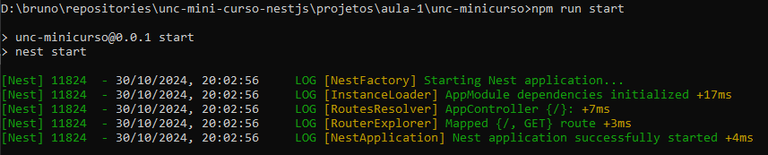

# Aula 1 - Instalação do NestJs, criação do projeto e definição das configurações iniciais do mesmo.

Primeiro passo é realizar a instalação do CLI (_command line interface_) do NestJs. Para isto utilize o seguinte comando:

```cmd
> npm install -g @nestjs/cli
```

Ao finalizar o comando temos o CLI do NestJs instalado, agora podemos utilizar o comando `nest` para executar comandos do NestJs.
Entre estes comandos temos o comando `nest new <nome_projeto>` para criar um novo projeto. O comando que iremos utilizar pode ser:

```cmd
> nest new unc-minicurso
```

Ao rodar o comando, selecione a opção `npm`, quando o projeto for criado, aparecerão os arquivos que foram criados.



Com o projeto criado, podemos acessar a pasta do projeto com `cd unc-minicurso` e utilizar o seguinte comando para rodar o projeto:

```cmd
> npm run start
```

Aparecerá a seguinte tela ao rodar o comand, ao acessar o navegador na url `localhost:3000`aparecerá a mensagem padrão `Hello World`.



Fim da primeira aula, instalamos o NestJs, criamos e iniciamos o projeto.

# Referências
- [NestJs first steps](https://docs.nestjs.com/first-steps)
