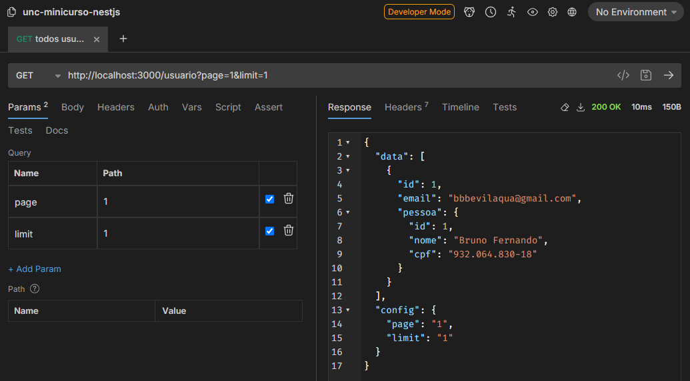

[Voltar](../README.md)

# Aula 10 - Criação de paginação para retornar a lista de usuários.

Em uma API, de vez em quando é necessário que a lista seja retornada em partes e não todos os dados, portanto nesta aula vamos aplicar o conceito de paginação na lista de usuários, igual fizemos na lista de pessoas.

primeiramente é necessário alterar o método `findall` do arquivo `usuario.controller.ts`, este método deverá ficar da seguinte forma:

```typescript
import { Controller, Get, Post, Body, Patch, Param, Delete, UseGuards, Query, } from '@nestjs/common';
...
@Get()
async findAll(@Query('page') page: string, @Query('limit') limit: string) {
  const filtroUsuario = {
    page: null,
    limit: null,
  };

  filtroUsuario.limit = limit == undefined ? 5 : parseInt(limit);
  filtroUsuario.page =
    page == undefined ? 0 : filtroUsuario.limit * (parseInt(page) - 1);

  return {
    data: await this.usuarioService.findAll(filtroUsuario),
    config: {
      page: page,
      limit: limit
    }
  };
}
...
```

Neste trecho utilizamos o **decorator** `Query` para receber a página (page) e a quantidade de itens por página (limit), isso é guardado em uma variável (filtroPessoa) e é passado para o método `findAll` do serviço de usuários.

No arquivo `usuario.service.ts` devemos atualizar o método `findAll` para receber as novas variáveis.

```typescript
...
findAll(filtroUsuario) {
  return this.usuarioServiceRepository.find({
    take: filtroUsuario.limit,
    skip: filtroUsuario.page,
  });
}
...
```

Agora para testar isso é necessário rodar o projeto com o comando `npm run start` e testar com a URL `http://localhost:3000/usuario?page=1&limit=1` no Bruno. Nesta URL, o parâmetro `page` indica a página que você está requisitanco e o parâmetro `limit` indica a quantidade máxima de registros por página.

Neste exemplo acima, o retorno será:




Fim da aula 6, conseguimos criar a paginação, você pode incluir registros na tabela de usuário e alterar os parâmetros `page` e `limit`.

# Referências
- [Projeto pessoal libevilaqua](https://github.com/BevilaquaBruno/libevilaqua-backend-nest)
- [Documentação NestJs](https://docs.nestjs.com/)
- [Bruno API Helper](https://www.usebruno.com/)
