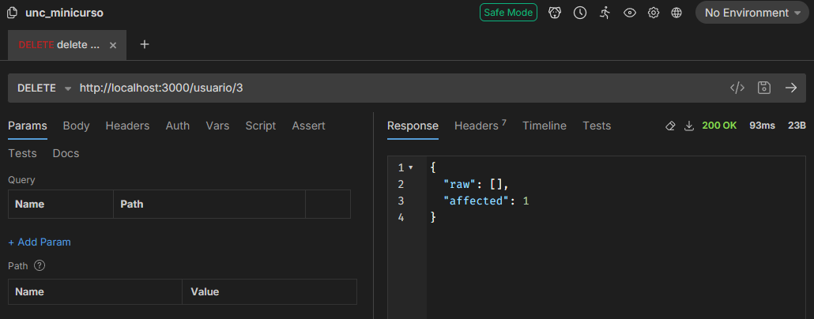
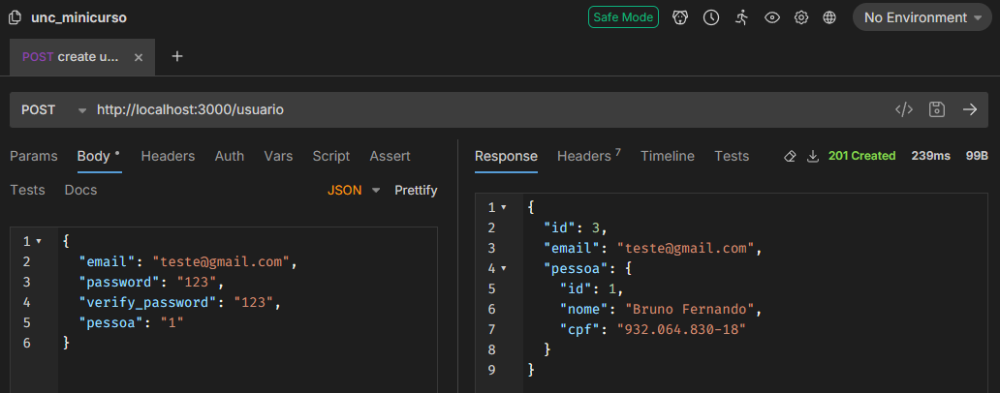

[Voltar](../README.md)

# Aula 11 - Continuação do CRUD de usuário, exclusão, criação e validações.

### Exclusão

Inicialmente vamos atualizar o método de exclusão, para isto devemos alterar o método `remove` do arquivo `usuario.service.ts`, que deve ficar da seguinte forma:

```typescript
async remove(id: number) {
  return await this.usuarioServiceRepository.delete({ id });
}
```

Aqui utilizamos o **repository** para chamar o método delete com base no **id** da pessoa que será passado na rota. Ao 
executar a URL do delete no **bruno**, teremos o seguinte retorno:



Ao executar esse método e olhar novamente no banco de dados, verá que o usuário número 3 foi excluído.

### Criação

Para a criação é necessário alterar o método `create` dentro do arquivo `usuario.service.ts`, que deve ficar da seguinte forma:

```typescript
create(createUsuarioDto: CreateUsuarioDto) {
  return this.usuarioServiceRepository.save(createUsuarioDto);
}
```

Antes de partir para o controller, é necessário que instalemos o `bcrypt` para gerar a senha criptografada, rode o seguinte comando:

```typescript
> npm install bcrypt
```

Agora é necessario que adicionemos um método `findByEmail` no arquivo `usuario.service.ts`, da seguinte forma:

```typescript
...
findByEmail(email: string) {
  return this.usuarioServiceRepository.findOne({
    select: {
      id: true,
      email: true,
      pessoa: {
        id: true,
        nome: true,
        cpf: true
      }
    },
    where: {
      email: email,
    },
  });
}
...
```

Ainda na criação, é necessário verificar o e-mail e senha informados no corpo da requisição, gerar a senha criptografada e ainda veficar se . Assim o método `create` do arquivo `usuario.controller.ts` deverá ficar assim.

```typescript
...
async create(@Body() createUserDto: CreateUsuarioDto) {
  if (createUserDto.password != createUserDto.verify_password) {
    throw new HttpException(
      'As senhas devem ser iguais',
      HttpStatus.BAD_REQUEST,
    );
  }
  const userAlreadyExists = await this.usuarioService.findByEmail(
    createUserDto.email,
  );

  if (userAlreadyExists?.email != undefined) {
    throw new HttpException(
      'Já existe um usuário com esse e-mail cadastrado',
      HttpStatus.BAD_REQUEST,
    );
  }

  createUserDto.password = await bcrypt.hash(createUserDto.password, 10);
  const newUser = await this.usuarioService.create(createUserDto);

  return this.usuarioService.findOne(newUser.id);
}
...
```

Ao Executar a URL do `POST` no **bruno**, teremos o seguinte retorno:


> informe um json com **email**, **password**, **password_verify** e **pessoa** no corpo da requisição, como acima.

Ao executar esse método e olhar novamente no banco de dados, verá que o usuário número 4 foi incluída.

# Referências
- [Gerador de CPF](https://www.4devs.com.br/gerador_de_cpf)
- [NestJs Controllers](https://docs.nestjs.com/controllers)
- [Projeto pessoal Libevilaqua](https://github.com/BevilaquaBruno/libevilaqua-backend-nest)
