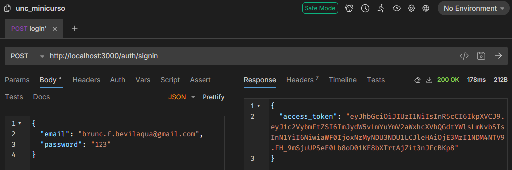

[Voltar](../README.md)

# Aula 13 - Validação de e-mail e senha para o login do usuário.

### Criação dos arquivos

Para a validação de e-mail e senha para o login do usuário será necessário primeiro criar um resource, vamos utilizar o nome `auth`:

```CMD
> nest g resource auth
```
Isto irá criar os arquivos igual anteriormente no usuário e na pessoa.
No arquivo 

Ao executar o comando serão feitas algumas perguntas pelo Nest, a pergunta **What transport layer do you use?** selecione **API**, e a pergunta **Would you like to generate CRUD entry points?** selecione **yes**.

### Edição do arquivo dto

Para o login, não existirá um cadastro e edição, portanto podemos **excluir** os arquivos `create-auth.dto.ts` e o `update-auth.dto.ts` e vamos criar um novo arquivo, chamado `main-auth.dto.ts` com o seguinte conteúdo:

```typescript
import { IsEmail, Length, IsNotEmpty } from 'class-validator';
export class MainAuthDto {
  @IsEmail({}, { message: 'Informe um e-mail válido' })
  @Length(7, 50, { message: 'Informe um e-mail válido' })
  email: string;

  @IsNotEmpty({ message: 'Informe a senha' })
  password: string;
}
```

### Arquivo service para o login

Antes de mexer no service, precisamos importar alguns módulos editando o arquivo `auth.module.ts`:

```typescript
...
import * as dotenv from 'dotenv';

dotenv.config();
...
@Module({
  controllers: [AuthController],
  providers: [AuthService],
  imports: [
    ConfigModule.forRoot(),
    UsuarioModule,
    JwtModule.register({
      global: true,
      secret: process.env['SECRET'],
      signOptions: { expiresIn: '86400s' },
    }),
  ],
})
...
```

> Se for necessário, instale os módulos com o comando `npm install --dev @nestjs/config @nestjs/jwt`.

Note que agora utilizaremos uma variável de ambiente chamada **SECRET**, edite o arquivo `.env` e o `.env.example` adicionando a nova variável **SECRET**.

```
...
SECRET=informe_uma_frase_aqui
```

No arquivo `auth.service.ts` podemos excluir todos os métodos e devemos criar um método que irá comparar a senha informada pelo usuário com a senha que existe no banco de dados para o e-mail, da seguinte forma:

```typescript
import { Injectable, UnauthorizedException } from '@nestjs/common';
import { UsuarioService } from 'src/usuario/usuario.service';
import { JwtService } from '@nestjs/jwt';
import * as bcrypt from 'bcrypt';

@Injectable()
export class AuthService {
  constructor(
    private usuarioService: UsuarioService,
    private jwtService: JwtService,
  ) {}

  async signIn(email: string, password: string) {
    const user = await this.usuarioService.findByEmail(email);

    const isValid = await bcrypt.compare(password, user.password);
    if (!isValid) {
      throw new UnauthorizedException();
    }
    const payload = { username: user.email, sub: user.id };

    return {
      access_token: await this.jwtService.signAsync(payload),
    };
  }
}
```
Neste método será validado a senha que foi informada com base no e-mail e caso esteja tudo correto, irá retornar o **access_token** para o usuário utilizar nas requisições seguintes.

No arquivo `auth.controller.ts` podemos remover todos os métodos e adicionar o método `signIn`, dessa forma:

```typescript
import { Controller, Post, Body, HttpCode, HttpStatus } from '@nestjs/common';
import { AuthService } from './auth.service';
import { MainAuthDto } from './dto/main-auth.dto';

@Controller('auth')
export class AuthController {
  constructor(private readonly authService: AuthService) {}

  @HttpCode(HttpStatus.OK)
  @Post('signin')
  signIn(@Body() signInDto: MainAuthDto) {
    return this.authService.signIn(signInDto.email, signInDto.password);
  }
}
```

Dessa forma o login fica pronto, basta no **bruno** utilizar um **POST** na URL **http://localhost:3000/auth/signin** passando o **email** e **password**:



Fim da aula 13, criamos o endpoint de login

# Referências
- [Projeto pessoal Libevilaqua](https://github.com/BevilaquaBruno/libevilaqua-backend-nest)
- [NestJs documentation](https://docs.nestjs.com/)
- [What is a JWT?](https://jwt.io/introduction)
