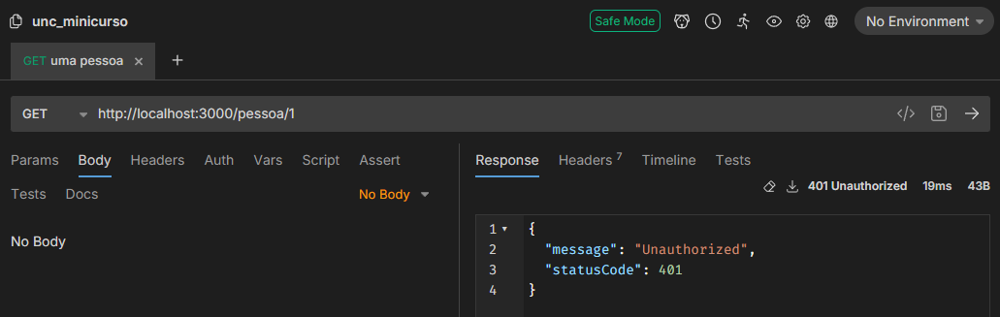
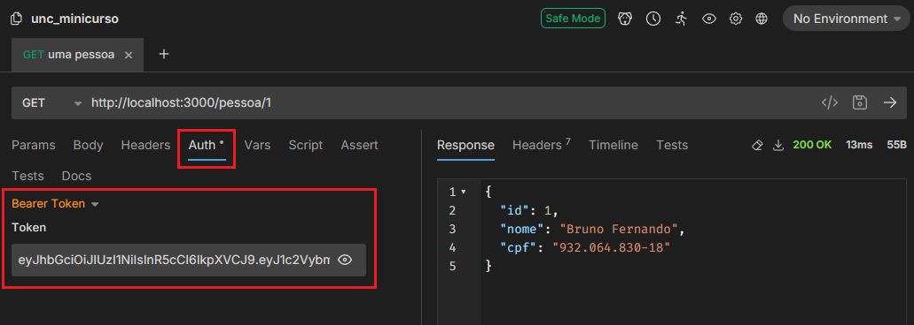

[Voltar](../README.md)

# Aula 14 - Adição de validação para cadastro de pessoas e usuários mediante token de login.

Para a validação das rotas com o `access_token` que o endpoint de login fornece, vamos criar um **guard** para isso. Podemos criar o arquivo `src/usuario/auth.guard.ts` com o seguinte conteúdo:

```typescript
import {
  CanActivate,
  ExecutionContext,
  Injectable,
  UnauthorizedException,
} from '@nestjs/common';
import { JwtService } from '@nestjs/jwt';
import { Request } from 'express';

@Injectable()
export class AuthGuard implements CanActivate {
  constructor(private jwtService: JwtService) {}

  async canActivate(context: ExecutionContext): Promise<boolean> {
    const request = context.switchToHttp().getRequest();
    const token = this.extractTokenFromHeader(request);
    if (!token) {
      throw new UnauthorizedException();
    }
    try {
      const payload = await this.jwtService.verifyAsync(token, {
        secret: process.env['SECRET'],
      });
      request['user'] = payload;
    } catch (error) {
      throw new UnauthorizedException();
    }
    return true;
  }

  private extractTokenFromHeader(request: Request): string | undefined {
    const [type, token] = request.headers.authorization?.split(' ') ?? [];
    return type === 'Bearer' ? token : undefined;
  }
}
```

Neste arquivo criamos dois métodos, o `canActivate` que implementa a classe `CanActivate`, ele irá pegar o token do header **Authorization** e irá validar com base no **SECRET** que incluímos no `.env`.

O metodo `extractTokenFromHeader` apenas extrai o token do header.

Feito isso podemos adicionar as validações nas rotas de pessoa e usuário, vou colocar um exemplo aqui, mas é necessário adicionar em todos e na pasta de **projetos** tem os arquivos caso tenha dúvidas.

```typescript
...
@Controller('pessoa')
export class PessoaController {
  constructor(private readonly pessoaService: PessoaService) {}

  @UseGuards(AuthGuard)
  @Post()
  async create(@Body() createPessoaDto: CreatePessoaDto) {
    let pessoaExiste = await this.pessoaService.findOneByCpf(createPessoaDto.cpf);
    if(null != pessoaExiste)
      throw new HttpException(
        'Já existe uma pessoa com este CPF',
        HttpStatus.BAD_REQUEST,
      );

    return this.pessoaService.create(createPessoaDto);
  }
...
}
```

A diretiva `@UseGuards(AuthGuard)` indica que a classe que criamos anteriormente deve ser usada, e por padrão é chamado o método `canActivate`.

Para testar, podemos tentar consultar uma pessoa na API sem passar o token, o retorno será:



O retorno **401 Unauthorized** será padrão sempre que não for passado o token ou quando o token for inválido.

Agora podemos executar a url de login e copiar o conteúdo do **access_token** retornado:


Esse token vamos inserir na aba **Auth** do **bruno** e tentar realizar novamente a consulta da API:



Note que no lado direito os dados foram retornados, mas isso aconteceu apenas por que usamos um token válido.

Fim da aula  14, criamos as validações para as rotas.

# Referências
- [Projeto pessoal Libevilaqua](https://github.com/BevilaquaBruno/libevilaqua-backend-nest)
- [NestJs documentation](https://docs.nestjs.com/)
- [What is a JWT?](https://jwt.io/introduction)
- [Bruno API Helper](https://www.usebruno.com/)
