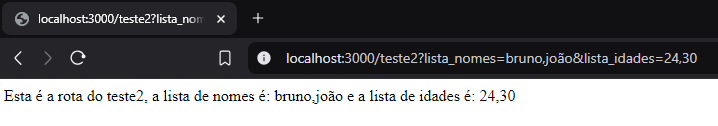
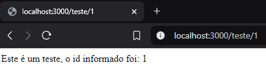
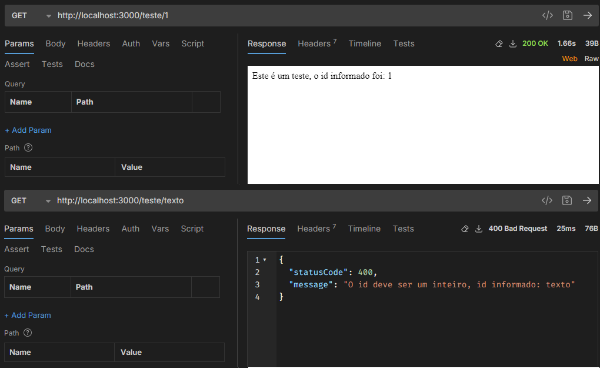

# Aula 3 - Testando parâmetros de URL com o GET, de corpo com o POST e exibindo erros user friendly.

Nesta aula iremos testar mais alguns parâmetros do NestJs usando decorators.

### Parâmetros de URL

Agora vamos criar uma nova rota para testar os parâmetros de URL, vamos adicionar a seguinte rota:

```typescript
  @Get('/teste2')
  getTeste2(
    @Query('lista_nomes') lista_nomes: string,
    @Query('lista_idades') lista_idades: string
  ): string {
    return 'Esta é a rota do teste2, a lista de nomes é: ' + lista_nomes + ' e a lista de idades é: ' + lista_idades;
  }
```

No código acima utilizamos o decorator `@Query` para indicar que o parâmetro é um parâmetro de URL, utilizado com o sinal "?" para indicar o início dos parâmetros e "&" para indicar a separação de cada parâmetro.

Ao rodar o projeto com o comand `npm run start` e acessar a URL `http://localhost:3000/teste2?lista_nomes=bruno,jo%C3%A3o&lista_idades=24,30` irá exibir a mensagem indicada.




### Parâmetros de rota

Inicialmente vamos editar a requisição get **/teste** criada na aula 2, vamos deixá-la deste jeito:

```typescript
  @Get('/teste/:id')
  getTeste(@Param('id') id: string): string {
    return 'Este é um teste, o id informado foi: ' + id;
  }
```

No código acima utilizamos o decorator `@Param` para indicar que aquele é um parâmetro passado na rota. Ao rodar o projeto com o comand `npm run start` e acessar a URL `localhost/teste/1` irá exibir a mensagem indicada.



### Erros user friendly

Para retornar erros user friendly, neste caso vamos trabalhar com a mesma URL dos parâmetros de rota, neste caso o usuário deve sempre retornar um número inteiro, caso contrário deverá retornar um erro. Para isso, podemos fazer da seguinte forma alterando o método anterior:

```typescript
  @Get('/teste/:id')
  getTeste(@Param('id') id: string): string {
    //transforma o id em inteiro
    let int_id = +id;

    //verifica se o id é NaN (not a number) e retorna erro caso seja
    if(Number.isNaN(int_id)){
      throw new HttpException(
        'O id deve ser um inteiro, id informado: ' + id,
        HttpStatus.BAD_REQUEST,
      );
    }

    return 'Este é um teste, o id informado foi: ' + id;
  }
```

Fazendo isso, os retornos das URL de teste `http://localhost:3000/teste/1` e `http://localhost:3000/teste/texto` respectivamente devem ser:



Dessa forma evitamos erros nas requisições ao banco de dados tratando o id repassado pelo consumidor da API.

Fim da aula 3, realizamos testes para entender melhor o funcionamento das requisições HTTP.

## Referências
- [Mozilla HTTP Status Code](https://developer.mozilla.org/pt-BR/docs/Web/HTTP/Status)
