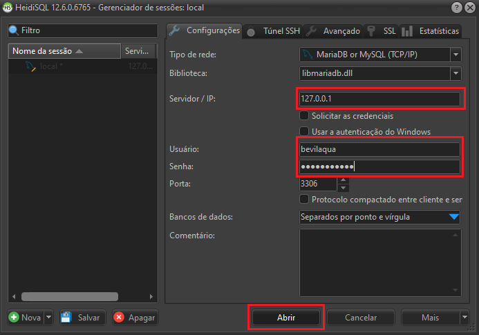
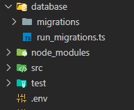
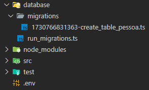
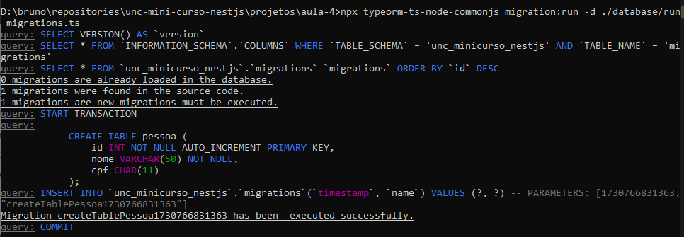

# Aula 4 - Adição do TypeORM ao projeto e criação de uma migration do banco de dados.

O **TypeORM** é uma biblioteca javascript ORM para diversos bancos de dados, neste caso vamos utilizar para comunicar com o **MySQL**.

Certifique-se que tenha o serviço do MySQL iniciado no computador, caso não tenha poderá inicializar pelo comando:

```cmd
> net start MySQL80
```

### Instalando o TypeORM e configurando a conexão

Neste caso será necessário instalarmos três repositórios distintos, o `typeorm`, `mysql2` e o `@nestjs/typeorm`.

```cmd
> npm install --save typeorm mysql2 @nestjs/typeorm
```

Para definirmos os dados da conexão com o banco de dados no código fonte, não devemos escrever diretamente nas variáveis correspondentes. Portanto é necessário criarmos um arquivo `.env` que não será enviado ao github e por fim um arquivo `.env.example` que será enviado ao github com dados fictícios para nos lembrar das variáveis de ambiente necessárias.

O conteúdo dos arquivos será o seguinte:

```
DB_HOST=localhost
DB_PORT=3306
DB_USERNAME=username
DB_PASSWORD=pass
DB_DATABASE=DATABASE
```
> lembre-se de trocar os dados de **username**, **password** e **database** no arquivo `.env` e não no `.env.example`.

Estas variáveis inseridas dentro do arquivo `.env` serão utilizadas no arquivo `src/app.module.ts`. Iremos incluir o seguinte trecho de código dentro da lista de `imports`:

```javascript
import { Module } from '@nestjs/common';
import { AppController } from './app.controller';
import { AppService } from './app.service';
import { TypeOrmModule } from '@nestjs/typeorm';
import * as dotenv from 'dotenv';

dotenv.config();

@Module({
  imports: [
    TypeOrmModule.forRoot({
      type: 'mysql',
      host: process.env['DB_HOST'],
      port: Number(process.env['DB_PORT']),
      username: process.env['DB_USERNAME'],
      password: process.env['DB_PASSWORD'],
      database: process.env['DB_DATABASE'],
      autoLoadEntities: true,
      synchronize: true,
      timezone: '-03:00',
    })
  ],
  controllers: [AppController],
  providers: [AppService],
})

export class AppModule {}
```

> Note que as variáveis usadas são as mesmas que estão dentro do arquivo `.env`. Além disso, a diretiva `syncronize` do código acima deve ser `false` em produção.

### Criando e rodando as migrações

Para que as migrações funcionem, é necessário que o banco de dados informado no arquivo `.env` seja criado. Para isso podemos acessar o MySQL através do HeidiSQL, basta informar o servidor, usuário e senha.



Para criar o banco de dados rode o seguinte comando:

```SQL
CREATE DATABASE unc_minicurso_nestjs;
```
> Para rodar o comando no HeidiSQL basta digitar e pressionar F9.

Para a criação das migrações vamos criar uma pasta chamada `database` e dentro dela um arquivo chamado `run_migrations.ts` e outra pasta chamada `migrations`.



Para criar as migrações, podemos usar o **CLI** do TypeORM, o comando para criar uma migração para o cadastro de pessoa, que é o primeiro que faremos, será:

```CMD
> typeorm migration:create ./database/migrations/create_table_pessoa
```

Quando o comando terminar a execução, podemos abrir e editar o arquivo da migração dentro da pasta de migrations criada anteriormente.



Os arquivos de migration são formados por dois métodos, o método **up** para a criação da tabela (create) e o método **down** para a exclusão da tabela (drop).

Para a criação da tabela de pessoa, vamos inserir apenas os campos **nome** e **cpf**, ficando da seguinte forma:

```javascript
public async up(queryRunner: QueryRunner): Promise<void> {
  await queryRunner.query(`
    CREATE TABLE pessoa (
      id INT NOT NULL AUTO_INCREMENT PRIMARY KEY,
      nome VARCHAR(100) NOT NULL,
      cpf CHAR(11)
    );`
  );
}

public async down(queryRunner: QueryRunner): Promise<void> {
  await queryRunner.query(`DROP TABLE pessoa;`);
}
```

O próximo passo é editar o arquivo unificador das migrations que serão rodadas, que é o arquivo `run_migrations.ts` criado anteriormente. Neste arquivo é necessário que sejam importadas **todas** as migrations para que sejam executadas no banco de dados informado, como temos apenas uma migration o comando ficará da seguinte forma:

```javascript
import { DataSource } from 'typeorm';
import * as dotenv from 'dotenv';

import { createTablePessoa1730766831363 } from './migrations/1730766831363-create_table_pessoa';

dotenv.config();

export const AppDataSource = new DataSource({
  type: 'mysql',
  host: process.env['DB_HOST'],
  port: Number(process.env['DB_PORT']),
  username: process.env['DB_USERNAME'],
  password: process.env['DB_PASSWORD'],
  database: process.env['DB_DATABASE'],
  migrations: [createTablePessoa1730766831363],
  migrationsTableName: 'migrations',
});
```

Para rodar a migração criada podemos usar o **npx** disponibilizado pelo **NPM**, ficando da seguinte forma:

```CMD
> npx typeorm-ts-node-commonjs migration:run -d ./database/run_migrations.ts
```
> Este script pode ser inserido dentro do `package.json` para facilitar utilizá-lo futuramente.

Caso tenha sucesso, aparecerá a seguinte mensagem:



Fim da quarta aula, criamos as migrations e configuramos a conexão com o banco de dados.

# Referências

- [SQL TypeORM](https://docs.nestjs.com/recipes/sql-typeorm)
- [TypeORM Website](https://typeorm.io/)
- [Projeto pessoal Libevilaqua](https://github.com/BevilaquaBruno/libevilaqua-backend-nest)
