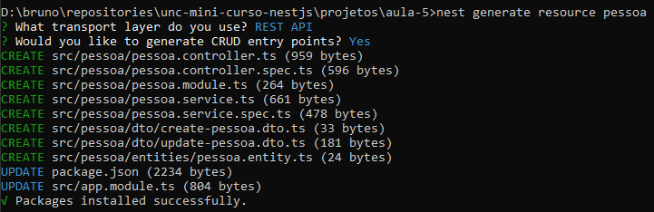
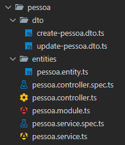
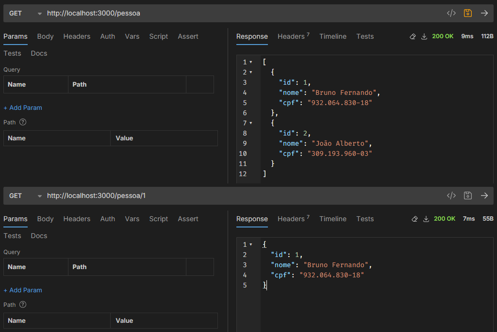

# Aula 5 - Início do CRUD de pessoa, listando todas e listando uma.

### Comando para criação dos arquivos

O primeiro CRUD que será criado é o de pessoa, que consiste no id, CPF e nome.

No NestJs, para criar um **CRUD** novo temos um comando para auxiliar a criação dos arquivos e adição do novo módulo, o comando que pode ser usado é:

```CMD
> nest generate resource pessoa
```

Este comando consiste no **nest** que instalamos anterirmente, a diretiva **generate resource** é para criar um CRUD inteiro, por fim o texto **pessoa** é o nome do do módulo que deverá ser criado.

Ao executar o comando serão feitas algumas perguntas pelo Nest, a pergunta **What transport layer do you use?** selecione **API**, e a pergunta **Would you like to generate CRUD entry points?** selecione **yes**.

O retorno do comando deve ser o seguinte da imagem:



Feito isso serão criados alguns arquivos para o CRUD, os arquivos são os seguintes:



- **src/pessoa/dto/**: Os arquivos da pasta `dto` contém classes auxiliares necessárias para a orientação a objeto, elas serão utilizadas para filtrar e trabalhar o corpo das requisições das APIs.
- **src/pessoa/entities/**: Os arquivos da pasta `entities` contém classes utilizadas para a comunicação com o banco de dados, são as entidades do sistema para que sejam utilizadas pelos services.
- **src/pessoa/pessoa.controller.ts:** Arquivo de controller que guardará a regra de negócio do software e retornará os dados ou erros com base no corpo da requisição do cliente.
- **src/pessoa/pessoa.service.ts:** Arquivo de "serviço" que guardará as requisições ao banco de dados do CRUD da pessoa, neste caso utilizaremos um ORM (_object relational mapper_) para controlar as requisições a base de dados futuramente.
- **src/pessoa/pessoa.module.ts:** Arquivo de módulo, guarda os controller, serviços, provedores e exportações de dados do módulo, geralmente existe um módulo para cada entidade do software.

### Personalização das entidades (entities)

No arquivo `src/pessoa/entities/pessoa.entity.ts` vamos inserir os campos correspondentes e suas funções na tabela de pessoa no banco de dados, bem como a função dele dentro da entidade para as requisições SQL.

Este arquivo deve ficar da seguinte forma:

```typescript
import { Column, Entity, PrimaryGeneratedColumn } from "typeorm";

@Entity()
export class Pessoa {
  @PrimaryGeneratedColumn()
  id: number;

  @Column()
  nome: string

  @Column()
  cpf: string;
}
```

Neste arquivo, primeiro definimos a classe como uma entidade, através do **decorator** `@Entity()`, depois inserimos os campos com o tipo de dados e o seu **decorator** para indicar o que aquele campo representa no esquema do banco de dados, o **decorator** `@PrimaryGeneratedColumn()` indica que aquele campo é uma chave primária e o **decorator** `@Column()` indica que o campo é apenas uma coluna comum no esquema do banco.

### Personalização dos dtos

Para realizar as validações das classes de forma correta, devemos instalar o pacote `class-validator` com o seguinte comando:

```CMD
> npm install class-validator
```

Nos arquivos `src/pessoa/dto/create-pessoa.dto.ts` e `src/pessoa/dto/update-pessoa.dto.ts` vamos inserir os campos correspondentes que serão trabalhados no corpo das requisições SQL por parte do consumidor da API.

O arquivo `create-pessoa.dto.ts` deve ficar da seguinte forma:

```typescript
import { IsNotEmpty, IsString, Matches, ValidateIf } from "class-validator";

export class CreatePessoaDto {

  @IsString({ message: 'Informe o nome da pessoa' })
  @IsNotEmpty({ message: 'O nome é obrigatório' })
  name: string;

  @ValidateIf((pessoa) => pessoa.cpf !== null)
  @IsString({ message: 'Informe novamente o CPF da pessoa' })
  @Matches(/\d{3}.\d{3}.\d{3}-\d{2}/g, { message: 'CPF inválido' })
  cpf: string;
}
```

Dentro do arquivo foram adicionados **decorators** específicos do `class-validator`, ao final desta aula terá um link para o repositório deles contento informações das funções utilizadas aqui.

Agora no arquivo `update-pessoa.dto.ts` será adicionado apenas o id da pessoa.

```typescript
import { PartialType } from '@nestjs/mapped-types';
import { CreatePessoaDto } from './create-pessoa.dto';

export class UpdatePessoaDto extends PartialType(CreatePessoaDto) {
  id: number;
}
```

### Criação dos enpoints para retornar todas as pessoas ou somente uma pessoa.

Para testar os enpoints que vamos criar é necessário primeiro incluir campos na tabela de pessoa, abra o **HeidiSQL** e execute a seguinte query:

```SQL
INSERT INTO pessoa (nome, cpf) VALUES ('Bruno Fernando', '93206483018');
INSERT INTO pessoa (nome, cpf) VALUES ('João Alberto', '30919396003');
```

Após inserir os dados, é necessário realizar a importação da feature da **entity** pessoa no módulo de pessoa e indicar ao **TypeORM** para utilizá-la. Isso pode ser feito editando o **decorator** `@Module` do arquivo `pessoa.module.ts` da seguinte forma:

```typescript
...
@Module({
  imports: [TypeOrmModule.forFeature([Pessoa])],
  controllers: [PessoaController],
  providers: [PessoaService],
})
...
```


Com a feature corretamente inserida nas importações, podemos configurar o arquivo `pessoa.service.ts`, mais especificamente os métodos `findall` e `findone`, que deverao ficar da seguinte forma:

```typescript
import { Injectable } from '@nestjs/common';
import { CreatePessoaDto } from './dto/create-pessoa.dto';
import { UpdatePessoaDto } from './dto/update-pessoa.dto';
import { InjectRepository } from '@nestjs/typeorm';
import { Repository } from 'typeorm';
import { Pessoa } from './entities/pessoa.entity';

@Injectable()
export class PessoaService {

  constructor( @InjectRepository(Pessoa) private pessoaServiceRepository: Repository<Pessoa>) {}

  create(createPessoaDto: CreatePessoaDto) {
    return 'This action adds a new pessoa';
  }

  findAll() {
    return this.pessoaServiceRepository.find();
  }

  findOne(id: number) {
    return this.pessoaServiceRepository.findOneBy({ id });
  }

  update(id: number, updatePessoaDto: UpdatePessoaDto) {
    return `This action updates a #${id} pessoa`;
  }

  remove(id: number) {
    return `This action removes a #${id} pessoa`;
  }
}
```

Note que foi adicionado uma linha para o **construtor** da classe, ele serve para importar o **service** da pessoa e injetar ele nesta classe, permitindo que seja utilizado no âmbito da classe.

No arquivo `pessoa.controller.ts` nada será alterado por enquanto.

### Testando os enpoints

Para testar os endpoints, é necessário executar duas URLs no aplicativo **Bruno** ou **Postman**, são elas:
- **http://localhost:3000/pessoa**: Para retornar a lista de todas as pessoas.
- **http://localhost:3000/pessoa/1**: Para retornar o cadastro da pessoa com o id informado.

O retorno deve parecido com o da seguinte imagem:



Fim da aula 5, conseguimos listar as pessoas e testar os enpoints.

# Referências
- [Gerador de CPF](https://www.4devs.com.br/gerador_de_cpf)
- [Projeto pessoal libevilaqua](https://github.com/BevilaquaBruno/libevilaqua-backend-nest)
- [TypeORM](https://typeorm.io/)
- [Class-validator](https://github.com/typestack/class-validator)
- [Documentação NestJs](https://docs.nestjs.com/)
- [Bruno API Helper](https://www.usebruno.com/)

