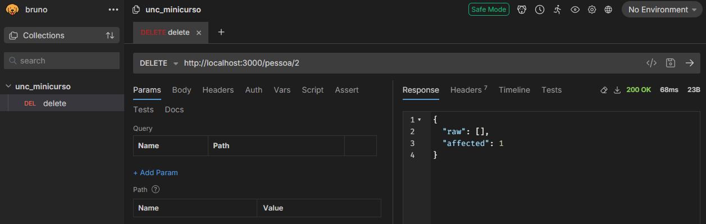
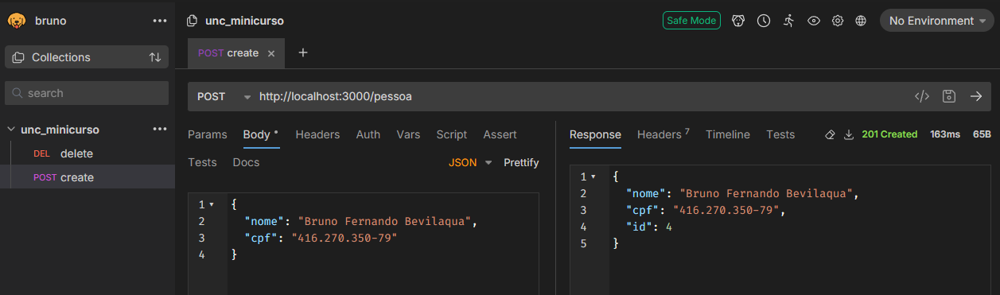
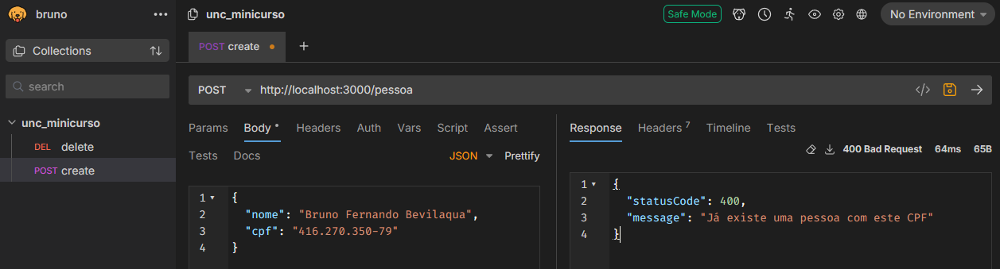

[Voltar](../README.md)

# Aula 7 - Continuação do CRUD de pessoa, exclusão, criação e validações.

### Exclusão

Inicialmente vamos atualizar o método de exclusão, para isto devemos alterar o método `remove` do arquivo `pessoa.service.ts`, que deve ficar da seguinte forma:

```typescript
async remove(id: number) {
  return await this.pessoaServiceRepository.delete({ id });
}
```

Aqui utilizamos o **repository** para chamar o método delete com base no **id** da pessoa que será passado na rota. Ao 
executar a URL do delete no **bruno**, teremos o seguinte retorno:



Ao executar esse método e olhar novamente no banco de dados, verá que a pessoa número 2 foi excluída.

### Criação

Para a criação é necessário alterar o método `create` dentro do arquivo `pessoa.service.ts`, que deve ficar da seguinte forma:

```typescript
create(createPessoaDto: CreatePessoaDto) {
  return this.pessoaServiceRepository.save(createPessoaDto);
}
```

Aqui utilizamos o **repository** para chamar o método save com base nos dados enviados no corpo da requisição. Ao 
executar a UTL do `POST` no **bruno**, teremos o seguinte retorno:


> informe um json com **nome** e **cpf** no corpo da requisição, como acima.

Ao executar esse método e olhar novamente no banco de dados, verá que a pessoa número 4 foi incluída.

### Validações

É possível adicionar validações antes de inserir a pessoa no banco de dados. Portanto, podemos criar um método `findOneByCpf` dentro do arquivo `pessoa.service.ts` para consultarmos se existe ou não um cadastro de pessoa com um CPF. Adicionamos o seguinte método no arquivo `pessoa.service.ts`:

```typescript
...
findOneByCpf(cpf: string) {
  return this.pessoaServiceRepository.findOneBy({ cpf });
}
...
```

Com o método criado, podemos utilizá-lo dentro do método `create`do arquivo `pessoa.controller.ts`, da seguinte forma:

```typescript
import { ..., HttpException, HttpStatus } from '@nestjs/common';
...
@Post()
async create(@Body() createPessoaDto: CreatePessoaDto) {
  let pessoaExiste = await this.pessoaService.findOneByCpf(createPessoaDto.cpf);
  if(null != pessoaExiste)
    throw new HttpException(
      'Já existe uma pessoa com este CPF',
      HttpStatus.BAD_REQUEST,
    );

  return this.pessoaService.create(createPessoaDto);
}
...
```

Neste método foi adicionado a variável `pessoaExiste` que armazena se já existe uma pessoa com o CPF informado no corpo da requisição.
Caso já exista este CPF no banco de dados, irá exibir uma exceção **BAD REQUEST** junto com a mensagem informada, como no exemplo abaixo utilizando o **Bruno**:



Aula finalizada, criamos a exclusão, criação e validação de uma pessoa com o CPF.

# Referências
[Gerador de CPF](https://www.4devs.com.br/gerador_de_cpf)
[NestJs Controllers](https://docs.nestjs.com/controllers)
[Projeto pessoal Libevilaqua](https://github.com/BevilaquaBruno/libevilaqua-backend-nest)
