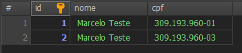

[Voltar](../README.md)

# Aula 8 - - Finalização do CRUD de pessoa, edição da pessoa.


### Edição no Service
Para a edição do cadastro de pessoa, devemos alterar os arquivos `pessoa.service.ts` e `pessoa.controller.ts`.

No arquivo `pessoa.service.ts` iremos editar o método **update**, que deverá ficar da seguinte forma:

```typescript
...
update(id: number, updatePessoaDto: UpdatePessoaDto) {
  return this.pessoaServiceRepository.update(id, updatePessoaDto);
}
...
```

### Validação de pessoa já cadastrada

Necessitamos, assim como na criação, a validação se essa pessoa que está sendo editada teve seu CPF alterado e informado o CPF de outra pessoa já existente.

Para isso vamos adicionar um novo método dentro do arquivo `pessoa.service.ts`, ficando da seguinte forma:

```typescript
import { ..., Not } from 'typeorm';
...
getRepeatedPessoa(id: number, cpf: string) {
  return this.pessoaServiceRepository.findOneBy({
    cpf: cpf,
    id: Not(id),
  });
}
...
```

Este método usa uma função do TypeORM que não usamos ainda, o **not**, neste exemplo a query irá buscar todas as pessoas que tem o CPF informado, menos a pessoa que está sendo editada, representada pelo campo **id**.

No arquivo `pessoa.controller.ts` podemos usar este método para validar a alteração no cadastro da pessoa alterando o método **update**.

```typescript
...
@Patch(':id')
async update(@Param('id') id: string, @Body() updatePessoaDto: UpdatePessoaDto) {
  let pessoaExiste = await this.pessoaService.getRepeatedPessoa(+id, updatePessoaDto.cpf);
  if(null != pessoaExiste)
    throw new HttpException(
      'Já existe uma pessoa com este CPF',
      HttpStatus.BAD_REQUEST,
    );

  return this.pessoaService.update(+id, updatePessoaDto);
}
...
```

Para testarmos, deixei o banco de dados da seguinte forma:



Dessa forma, executando uma URL no **Bruno** para tentar editar um registro inserindo o CPF que já existe em outro registro, irá retornar uma mensagem de erro, conforme observado:


Fim da aula 8, terminamos o CRUD de pessoa e testamos a edição da pessoa com uma validação.

# Referências
- [Projeto pessoal libevilaqua](https://github.com/BevilaquaBruno/libevilaqua-backend-nest)
- [TypeORM Find Options](https://orkhan.gitbook.io/typeorm/docs/find-options)
