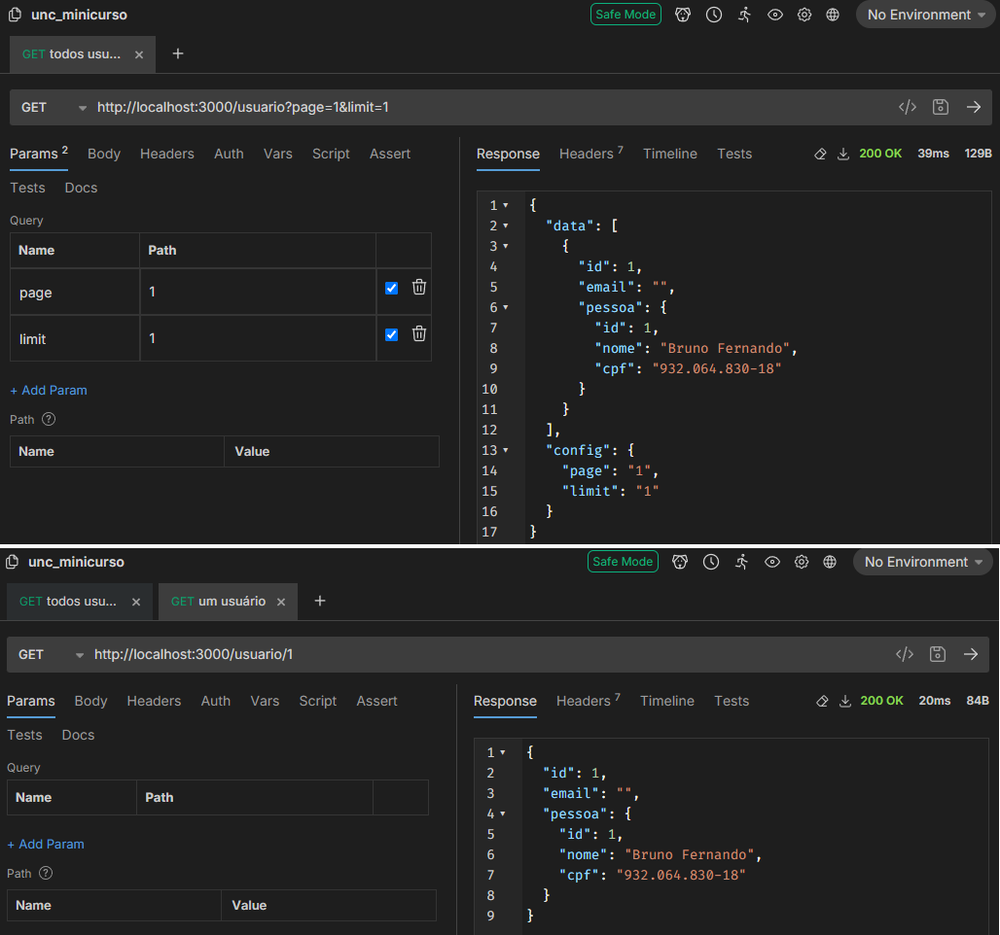

[Voltar](../README.md)

# Aula 9 - Início do CRUD de usuário, listando todos e listando um.

### Criação da migration para o usuário

Para a criação da migration do usuário, utilizamos o comando:

```CMD
> typeorm migration:create ./database/migrations/create_table_usuario
```

Quando o comando terminar a execução, podemos abrir e editar o arquivo da migração dentro da pasta de migrations criada anteriormente, devemos deixá-lo da seguinte forma:

```typescript
import { MigrationInterface, QueryRunner } from "typeorm";

export class CreateTableUsuario1732132768859 implements MigrationInterface {

  public async up(queryRunner: QueryRunner): Promise<void> {
    await queryRunner.query(`
      CREATE TABLE usuario (
        id INT NOT NULL AUTO_INCREMENT PRIMARY KEY,
        email VARCHAR(100) NOT NULL,
        password VARCHAR(255),
        pessoaId INT,

        CONSTRAINT FK_pessoa_usuario FOREIGN KEY (pessoaId) REFERENCES pessoa(id)
      );`);
  }

  public async down(queryRunner: QueryRunner): Promise<void> {
    await queryRunner.query(`DROP TABLE usuario;`);
  }

}
```

Criando a migração, devemos adicioná-la no arquivo `run_migrations.ts`:

```typescript
import { DataSource } from 'typeorm';
import * as dotenv from 'dotenv';

import { createTablePessoa1730766831363 } from './migrations/1730766831363-create_table_pessoa';
import { CreateTableUsuario1732132768859 } from './migrations/1732132768859-create_table_usuario';

dotenv.config();

export const AppDataSource = new DataSource({
  type: 'mysql',
  host: process.env['DB_HOST'],
  port: Number(process.env['DB_PORT']),
  username: process.env['DB_USERNAME'],
  password: process.env['DB_PASSWORD'],
  database: process.env['DB_DATABASE'],
  migrations: [createTablePessoa1730766831363, CreateTableUsuario1732132768859],
  migrationsTableName: 'migrations',
});
```

Para rodar a migração, utilizamos o comando:

```CMD
> npx typeorm-ts-node-commonjs migration:run -d ./database/run_migrations.ts
```

E no banco de dados, através do **Heidi** podemos incluir alguns usuários para testar:

```SQL
INSERT INTO usuario (email, password, pessoaId) VALUES ('bbbevilaqua@gmail.com', '$2b$10$CJNRnD4NHGQWnrQeffk5u.pbRP.mOEIyCLWLqrCDx4kGKSVBoNQe6', 1);
INSERT INTO usuario (email, password, pessoaId) VALUES ('bruno.f.bevilaqua@gmail.com', '$2b$10$CJNRnD4NHGQWnrQeffk5u.pbRP.mOEIyCLWLqrCDx4kGKSVBoNQe6', 2);
```

> Este campo da senha já está em um padrão que criaremos depois.

### Comando para criação dos arquivos

A criação do CRUD de usuário será feito da mesma forma do CRUD de pessoa da aula 5, portanto não darei muitos detalhes aqui.

Primeiro passo é criar os arquivos com o comando do NestJs.

```CMD
> nest generate resource usuario
```

Ao executar o comando serão feitas algumas perguntas pelo Nest, a pergunta **What transport layer do you use?** selecione **API**, e a pergunta **Would you like to generate CRUD entry points?** selecione **yes**.

Com este comando serão criados os mesmos arquivos que anteriormente no cadastro de pessoa.

### Personalização das entidades (entities)

No arquivo `src/usuario/entities/usuario.entity.ts` vamos inserir os campos correspondentes e suas funções na tabela de usuário no banco de dados, bem como a função dele dentro da entidade para as requisições SQL.

Este arquivo deve ficar da seguinte forma:

```typescript
import { Pessoa } from "src/pessoa/entities/pessoa.entity";
import { Column, Entity, JoinColumn, ManyToOne, PrimaryGeneratedColumn } from "typeorm";

@Entity()
export class Usuario {
  @PrimaryGeneratedColumn()
  id: number;

  @Column()
  email: string;

  @Column({ select: false, nullable: true })
  password: string;

  @ManyToOne(() => Pessoa, { eager: true })
  @JoinColumn({ foreignKeyConstraintName: 'FK_pessoa_usuario' })
  pessoa: Pessoa;

}
```

Nos arquivos `src/usuario/dto/create-usuario.dto.ts` e `src/usuario/dto/update-usuario.dto.ts` vamos inserir os campos correspondentes que serão trabalhados no corpo das requisições SQL por parte do consumidor da API.

```typescript
//create-usuario.dto.ts
import { IsEmail, Length } from "class-validator";
import { CreatePessoaDto } from "src/pessoa/dto/create-pessoa.dto";

export class CreateUsuarioDto {

  Pessoa: CreatePessoaDto;

  @IsEmail({}, { message: 'Informe um e-mail válido' })
  @Length(7, 50, { message: 'Informe um e-mail válido' })
  email: string;

  password: string;
  verify_password: string;
}

```

```typescript
//update-usuario.dto.ts
import { PartialType } from '@nestjs/mapped-types';
import { CreateUsuarioDto } from './create-usuario.dto';

export class UpdateUsuarioDto extends PartialType(CreateUsuarioDto) {
  id: number;
}

```

### Criação dos enpoints para retornar todas as pessoas ou somente uma pessoa.

Inicialmente, no arquivo `usuario.module.ts` é necessário colocar o **service**:

```typescript
...
import { TypeOrmModule } from '@nestjs/typeorm';
import { Usuario } from './entities/usuario.entity';
...
@Module({
  imports: [TypeOrmModule.forFeature([Usuario])],
  controllers: [UsuarioController],
  providers: [UsuarioService],
})
...
```

No arquivo `usuario.service.ts` editamos os métodos `findOne` e `findAll`:

```typescript
import { Injectable } from '@nestjs/common';
import { CreateUsuarioDto } from './dto/create-usuario.dto';
import { UpdateUsuarioDto } from './dto/update-usuario.dto';
import { InjectRepository } from '@nestjs/typeorm';
import { Usuario } from './entities/usuario.entity';
import { Repository } from 'typeorm';

@Injectable()
export class UsuarioService {
  constructor(
    @InjectRepository(Usuario)
    private usuarioServiceRepository: Repository<Usuario>,
  ) {}

  create(createUsuarioDto: CreateUsuarioDto) {
    return 'This action adds a new usuario';
  }

  findAll(filtroUsuario) {
    return this.usuarioServiceRepository.find({
      take: filtroUsuario.limit,
      skip: filtroUsuario.page,
    });
  }

  findOne(id: number) {
    return this.usuarioServiceRepository.findOneBy({ id });
  }

  update(id: number, updateUsuarioDto: UpdateUsuarioDto) {
    return `This action updates a #${id} usuario`;
  }

  remove(id: number) {
    return `This action removes a #${id} usuario`;
  }
}
```

O arquivo `usuario.controller.ts` devemos editar o método **findAll** para trabalhar com a páginação.

```typescript
import { ..., Query, HttpException, HttpStatus } from '@nestjs/common';
...
@Get()
async findAll(@Query('page') page: string, @Query('limit') limit: string) {
  const filtroUsuario = {
    page: null,
    limit: null,
  };

  filtroUsuario.limit = limit == undefined ? 5 : parseInt(limit);
  filtroUsuario.page =
    page == undefined ? 0 : filtroUsuario.limit * (parseInt(page) - 1);

  return {
    data: await this.usuarioService.findAll(filtroUsuario),
    config: {
      page: page,
      limit: limit
    }
  };
}

@Get(':id')
findOne(@Param('id') id: string) {
  return this.usuarioService.findOne(+id);
}
...
```

### Testando os enpoints

Para testar os endpoints, é necessário executar duas URLs no aplicativo **Bruno** ou **Postman**, são elas:
- **http://localhost:3000/usuario**: Para retornar a lista de todas as usuários.
- **http://localhost:3000/usuario/1**: Para retornar o cadastro da usuário com o id informado.

O retorno deve parecido com o da seguinte imagem:



Fim da aula 9, conseguimos listar os usuários e testar os endpoints.

# Referências
- [Projeto pessoal libevilaqua](https://github.com/BevilaquaBruno/libevilaqua-backend-nest)
- [TypeORM](https://typeorm.io/)
- [Class-validator](https://github.com/typestack/class-validator)
- [Documentação NestJs](https://docs.nestjs.com/)
- [Bruno API Helper](https://www.usebruno.com/)
